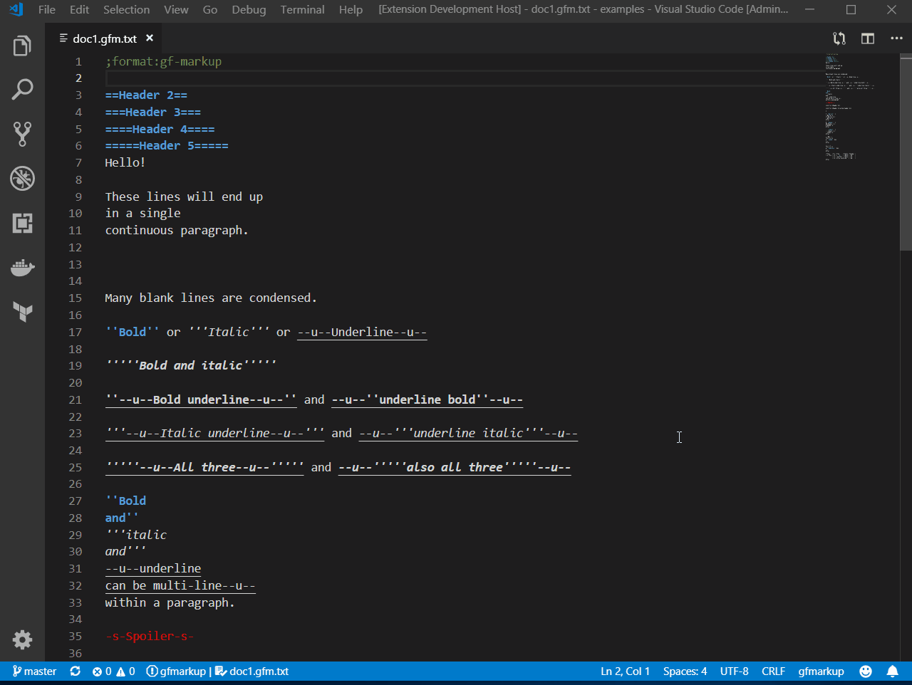

# gfmarkup-vscode

This VSCode extension provides support for the
[GameFAQs Markup](https://gamefaqs.gamespot.com/help/53-formatted-faqs-markup)
text file format.

## Features

* Syntax highlighting.
* HTML preview of the final document, including table of contents,
  clickable links, synchronized scrolling, and live updates as you type.

## Usage

The extension will automatically recognize any file whose name ends with
`.gfm.txt` or whose content begins with `;format:gf-markup`.

See the next section for how to use the HTML preview.

## Commands

You can run these commands by opening the command pallette with
`ctrl+shift+P` (or `cmd+shift+P` on Mac). The command names are prefixed
with `GameFAQs Markup: `.

* `Open preview`
  * Open an HTML preview of the current document.
* `Scan files for markup flag`
  * Start checking files for the `;format:gf-markup` flag and, if found,
    activate the extension's features for them.

## Settings

* `gfmarkup.autoScan`
  * The default is `true`, meaning the extension will automatically start
    scanning for markup files (`;format:gf-markup`) without you having to
    run the scan command. You can set this to `false` to require either manual
    scanning or a matching file extension (`.gfm.txt`).
